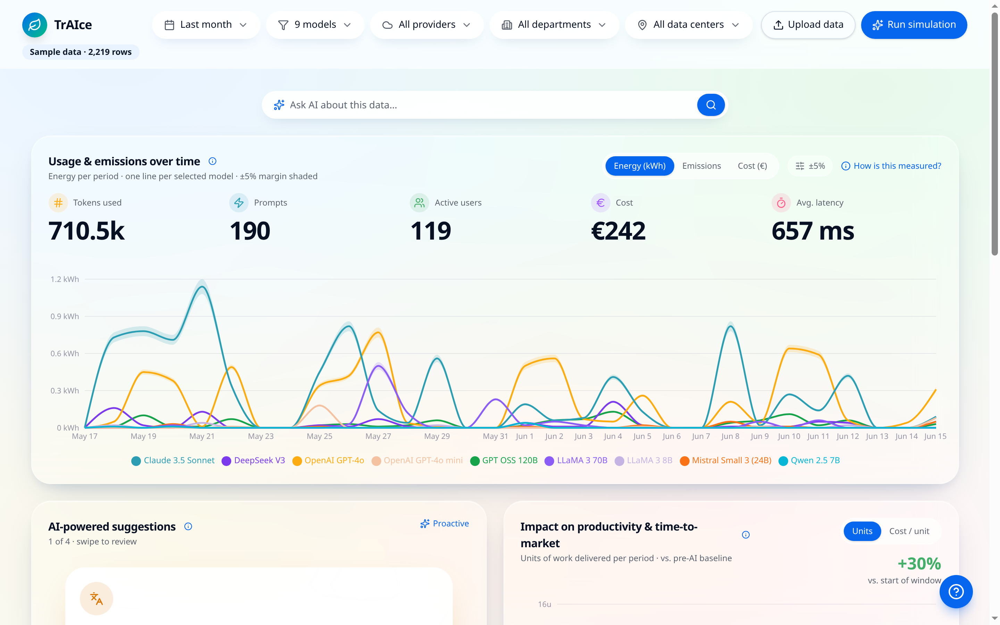

# TrAIce



TrAIce is a prototype dashboard frontend for exploring enterprise AI usage
and its energy & carbon footprint. It was built by contributors from ING, RVO, UWV, DNB,
UvA, and the University of Twente during a TNO challenge on measuring the
energy footprint of AI.

This app now consumes mock dashboard data from a FastAPI backend and still lets
users upload their own CSV to explore charts, breakdowns, and trends.

## Features

- Interactive dashboards for AI usage, cost, and energy metrics
- Backend-driven synthetic dataset (via FastAPI)
- Client-side CSV upload — data never leaves the browser
- Responsive UI built with shadcn/ui, Radix, Tailwind CSS v4, and Recharts
- File-based routing via TanStack Router / TanStack Start

## Tech stack

- React 19 + TypeScript
- TanStack Start v1 (Vite 7) with file-based routing
- Tailwind CSS v4 + shadcn/ui + Radix primitives
- Recharts for visualisations
- PapaParse for client-side CSV parsing
- Framer Motion for animations

## Project structure

```
public/                  Static assets (incl. sample-ai-usage.csv)
src/
  components/            UI + feature components (shadcn/ui in components/ui)
  hooks/                 Reusable React hooks
  lib/                   Data model, mock data, CSV parsing, helpers
  routes/                File-based routes (TanStack Router)
  router.tsx             Router bootstrap
  routeTree.gen.ts       AUTO-GENERATED — do not edit
  styles.css             Tailwind v4 entry
```

## Requirements

- Node.js 20+ (22 recommended)
- npm, pnpm, or bun

## Installation

```bash
# with bun (recommended, matches the lockfile)
bun install

# or with npm
npm install
```

## Local development

```bash
bun dev        # or: npm run dev
```

The app runs at http://localhost:8080 by default.

To load default dashboard data, run the backend service from the repository root
(`../backend`) and set `VITE_API_BASE_URL` when needed.

## Build

```bash
bun run build         # production build
bun run build:dev     # dev-mode build (source maps, unminified)
bun run preview       # preview the production build locally
npm run start         # serve the production build with server.cjs after build
```

## Docker (distroless)

This package includes a multi-stage Docker build where:

- `development` target runs Vite with hot reload
- `production` target runs distroless `nonroot` with `server.cjs`

In the workspace production stack, edge hardening and TLS are handled by a
separate ingress image under `../nginx`.

```bash
npm run docker:build
npm run docker:run
```

Or directly:

```bash
docker build -t traice .
docker run --rm -p 8080:8080 traice
```

Optional build args:

- `NODE_VERSION` (default: `26`)
- `PORT` (default: `8080`)
- `VITE_BASE_PATH` (default: `/`)

The production runtime serves the frontend app and is intended to sit behind
the dedicated ingress service in `docker-compose.prod.yml`.

## Environment variables

- `VITE_API_BASE_URL` (optional): Backend base URL, default `http://localhost:8000`

## Data model

The sample CSV in `public/sample-ai-usage.csv` uses fully synthetic data
(fictional user ids like `u1000`, made-up department/provider labels). See
`src/lib/csv-schema.ts`, `src/lib/uploaded-data.ts`, and `src/lib/mock-data.ts`
for column definitions and dashboard data types.

## Deployment

Any static-friendly Node host works. Common options:

- **Vercel / Netlify** — point the platform at this repo,
  set the build command to `bun run build` (or `npm run build`), and serve
  the generated `dist/client` directory.

## License

Prototype — no license granted by default. Contact the contributors before
reusing beyond evaluation.
